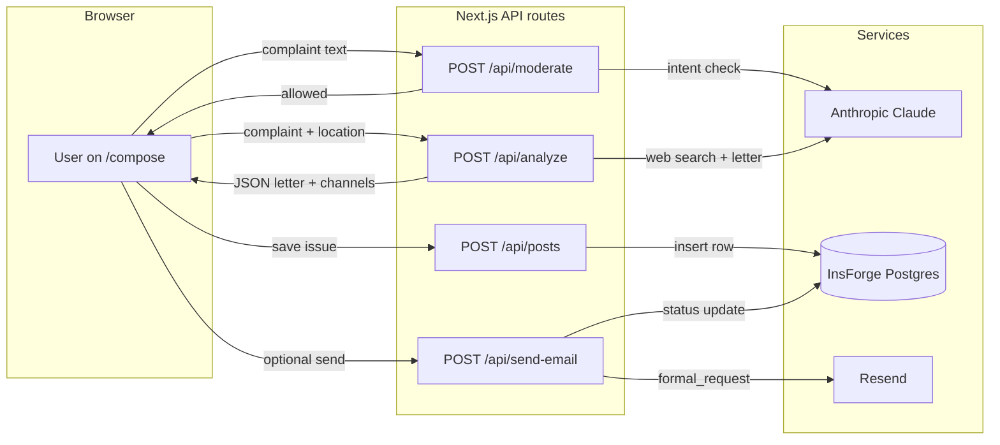

# Civilian — architecture

## Request flow (raise issue → official email)

## Auth & profile (optional Google sign-in)

- `pages/api/auth/[...nextauth].js` → `lib/auth.js` (Google OAuth)
- On sign-in, `lib/insforge.js` `upsertProfile()` writes `profiles`
- Posts can attach `user_id`, `user_display_name`, `user_avatar` when a session exists

## Echo integrity

- Client stores `civilian_echo_fp` in `localStorage` and sends `X-Civilian-Fingerprint`
- `POST /api/echo` resolves actor via session user id, fingerprint header, or hashed IP+UA
- InsForge `echoes` table enforces `UNIQUE(post_id, user_id)`; count increments only on new row

## Moderation philosophy

- **Intent-based** (`/api/moderate`): civic frustration allowed; abuse blocked
- **Fail-open**: if Anthropic is down or JSON parse fails, the request is allowed so residents are not silently blocked

## Rate limiting

- `POST /api/analyze` uses in-memory sliding window per IP (`lib/rateLimit.js`)
- Tune via `ANALYZE_RATE_LIMIT_MAX` and `ANALYZE_RATE_LIMIT_WINDOW_MS`
- For multi-instance production, replace with Upstash Redis / Vercel KV
